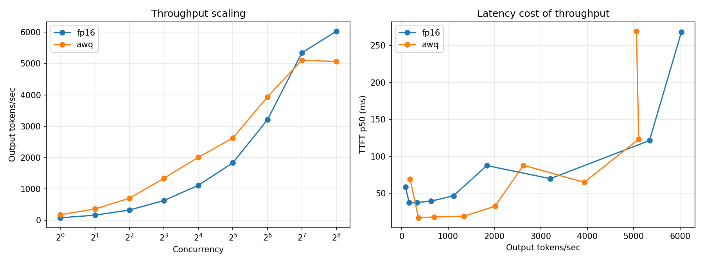

# llm-serving-bench

Measuring what it actually costs to serve an open-weights LLM: throughput, time-to-first-token, and inter-token latency across a concurrency sweep — and what quantization does to that tradeoff.

Most published LLM benchmarks report a single throughput number at an unstated batch size. That number is close to useless for capacity planning, because throughput and latency trade against each other and the answer changes with load. This repo measures the full curve for two serving configurations and finds that **the better configuration depends entirely on where on the curve you operate.**

Output quality is measured separately in [llm-eval-harness](https://github.com/cooltaker14/llm-eval-harness), because a throughput win that degrades output is not a win. Results are summarised below.

---

## Headline result

**Qwen2.5-7B-Instruct** on a single **A100-SXM4-40GB**, vLLM 0.25.0, 1024-token prompts, 256-token generations. bf16 vs AWQ int4, identical model, identical workload.

| Concurrency | bf16 tok/s | AWQ tok/s | AWQ advantage | bf16 ITL p50 | AWQ ITL p50 |
|---:|---:|---:|---:|---:|---:|
| 1 | 81 | **181** | **2.23x** | 12.2 ms | 5.3 ms |
| 2 | 164 | **362** | **2.21x** | 12.0 ms | 5.5 ms |
| 4 | 328 | **703** | **2.15x** | 12.0 ms | 5.5 ms |
| 8 | 630 | **1,338** | **2.12x** | 12.5 ms | 5.8 ms |
| 16 | 1,117 | **2,011** | **1.80x** | 13.0 ms | 6.3 ms |
| 32 | 1,835 | **2,624** | **1.43x** | 14.2 ms | 7.5 ms |
| 64 | 3,204 | **3,933** | **1.23x** | 17.0 ms | 11.8 ms |
| 128 | **5,340** | 5,108 | 0.96x | 20.1 ms | 18.4 ms |
| 256 | **6,028** | 5,060 | 0.84x | 29.7 ms | 32.8 ms |

**AWQ int4 is 2.2x faster than bf16 at concurrency 1 and 19% slower at concurrency 256.** The curves cross at 128.



3,072 requests across both sweeps. Zero failures.

---

## Why the crossover happens

This is a roofline story, and it is the reason a single-number benchmark would give the wrong answer.

**At low concurrency the GPU is memory-bandwidth bound.** Every decode step reloads the entire weight matrix from HBM to produce one token per sequence. int4 weights are a quarter the size of bf16, so that transfer is four times cheaper — inter-token latency drops from 12.2 ms to 5.3 ms and throughput more than doubles. The GPU's compute units are mostly idle either way, so the dequantization arithmetic is effectively free.

**At high concurrency the GPU becomes compute bound.** Continuous batching already amortizes each weight load across many concurrent sequences, so the bandwidth saving that made int4 attractive has been captured by batching instead. What remains is the dequantization work itself, which is now pure added cost on a saturated compute unit. bf16 pulls ahead.

**AWQ also saturates earlier.** Going from concurrency 128 to 256, AWQ throughput *declines* by 0.9% (5,108 → 5,060 tok/s) while bf16 still gains 12.9% (5,340 → 6,028). AWQ reaches a ceiling that bf16 has not yet hit at the top of this sweep.

### What this means in practice

| Traffic pattern | Choose | Why |
|---|---|---|
| Interactive, low concurrency | **AWQ int4** | 2.2x throughput, half the inter-token latency, smoother streaming |
| Saturated batch serving | **bf16** | 19% more throughput at peak, and it keeps scaling past 256 |

"int4 is faster" is true for less than half of the range measured here. The right question is not which quantization is faster but *where on the load curve you actually operate.*

---

## Does the quantized model still produce correct output?

A throughput comparison is only actionable if quality holds. Measured in the companion repo on a 40-item hand-labelled extraction task, at temperature 0, with paired statistics:

| Metric | bf16 | AWQ | Delta | 95% CI | p |
|---|---:|---:|---:|---|---:|
| Field score (partial credit) | 0.683 | 0.700 | +0.017 | [−0.025, +0.067] | 0.438 |
| All fields correct | 0.225 | 0.300 | +0.075 | [−0.031, +0.116] | 0.375 |

Both configurations produced valid, schema-conformant JSON on 100% of items. **No measurable accuracy cost from int4** — AWQ is nominally higher, but the difference sits well inside the interval.

The honest caveat, which the eval harness prints itself: with n=40 the smallest detectable difference is **0.066** at 80% power. The defensible claim is "no degradation larger than about 7 points," not "identical quality."

**One real difference the accuracy numbers do not show.** AWQ produced a runaway generation on one item — four mutually contradictory JSON objects, running into the 200-token cap on a question bf16 answered in 34 tokens. bf16 hit the cap zero times. Both models emitted duplicate objects at the same 5% rate, so a flat rate looks identical; the severity does not.

| Signal | bf16 | AWQ |
|---|---:|---:|
| Hit token cap | 0 (0.0%) | 1 (2.5%) |
| Emitted >1 JSON object | 2 (5.0%) | 2 (5.0%) |
| Objects contradict each other | 0 (0.0%) | 1 (2.5%) |
| Tokens generated after first object | ~84 | ~202 |

That is a production concern — unbounded latency and wasted spend on a request that was already answered — and it is invisible to every accuracy metric, since the extractor recovers the correct first object.

**Full conclusion:** AWQ int4 buys 2.2x throughput at low concurrency at no measurable accuracy cost, with a 2.5% rate of runaway generation that bf16 did not exhibit. For interactive serving that is a good trade if you cap output length. For saturated batch serving, bf16 wins on throughput anyway.

---

## Capacity under a latency SLO

Peak throughput is the wrong number for capacity planning. Under a **TTFT p99 budget of 1000 ms**:

| Config | Sustainable throughput | At concurrency |
|---|---:|---:|
| bf16 | 6,028 tok/s | 256 |
| AWQ | 5,108 tok/s | 128 |

Note that for bf16, concurrency **64 violates** this budget (TTFT p99 = 1,427 ms) while concurrency 256 meets it (737 ms) — see the tail behaviour below. The intuition that lower concurrency is always safer for latency is wrong here.

---

## Tail latency is non-monotonic

Full percentiles for the bf16 sweep:

| Concurrency | Output tok/s | Per-worker | Scaling eff. | TTFT p50 | TTFT p99 | ITL p50 | E2E p50 |
|---:|---:|---:|---:|---:|---:|---:|---:|
| 1 | 81 | 81.2 | 100% | 58 ms | 66 ms | 12.2 ms | 3.16 s |
| 2 | 164 | 82.0 | 101% | 37 ms | 39 ms | 12.0 ms | 3.10 s |
| 4 | 328 | 81.9 | 101% | 37 ms | 40 ms | 12.0 ms | 3.11 s |
| 8 | 630 | 78.8 | 97% | 39 ms | 51 ms | 12.5 ms | 3.23 s |
| 16 | 1,117 | 69.8 | 86% | 47 ms | 488 ms | 13.0 ms | 3.38 s |
| 32 | 1,835 | 57.3 | 71% | 87 ms | 882 ms | 14.2 ms | 4.16 s |
| 64 | 3,204 | 50.1 | 62% | 70 ms | **1,427 ms** | 17.0 ms | 4.57 s |
| 128 | 5,340 | 41.7 | 51% | 121 ms | **348 ms** | 20.1 ms | 6.00 s |
| 256 | 6,028 | 23.5 | 29% | 268 ms | 737 ms | 29.7 ms | 10.76 s |

**TTFT p99 peaks at concurrency 64, then improves at 128 before rising again.** The same shape appears in the AWQ sweep (768 ms at 64, 365 ms at 128).

The plausible mechanism is chunked prefill. At moderate concurrency, prefill of 1024-token prompts collides unpredictably with in-flight decode, so individual requests occasionally wait behind a large prefill chunk. At higher concurrency the scheduler settles into a steadier interleaving and the tail tightens. **A benchmark reporting medians only would have missed this entirely** — TTFT p50 at concurrency 64 is a perfectly healthy 70 ms.

### Other structure in the curve

**Batching is free below concurrency 4.** Per-worker throughput holds flat at ~82 tok/s (bf16) and TTFT *improves* from 58 ms to 37 ms. The GPU is bandwidth bound and largely idle — single-stream serving wastes most of an A100.

**Decode degrades gracefully; queueing does not.** ITL p50 rises only 2.4x across the entire 256x concurrency range. End-to-end latency rises 3.4x, and nearly all of that gap is time spent waiting rather than generating.

**Memory.** Of 40,960 MiB, bf16 weights occupy 14.29 GiB, leaving 20.1 GiB of KV cache — 376,336 tokens, roughly 92 concurrent requests at the full 4,096-token context. Concurrency 256 exceeds what the cache holds simultaneously, so the scheduler preempts and requeues. That is the sharp E2E rise at the final data point.

---

## What gets measured, and why

| Metric | Definition | Why it matters |
|---|---|---|
| **TTFT** | Request sent → first token received | Perceived responsiveness. Dominated by prefill and queueing. |
| **ITL** | Gap between consecutive tokens | Whether streaming output feels smooth. Dominated by decode. |
| **Output tok/s** | Generated tokens ÷ wall time | The capacity number. Rises with batching, then plateaus. |
| **E2E p50/p90** | Full request wall time | The number users actually experience. |

Four choices that make these numbers trustworthy:

1. **Client-side timing.** Server-side metrics exclude queueing delay — precisely what degrades under load. Every number here is measured from the caller.
2. **Distinct prompts per request.** Reusing one prompt lets prefix caching serve TTFT from cache, inflating results. Each prompt carries a unique prefix.
3. **Warmup excluded.** The first requests after server start pay CUDA graph capture and allocator warmup costs. Those are run and discarded.
4. **Exact token counts.** Completion lengths come from the server's `usage` block, not inferred from streamed chunk counts.

Percentiles are computed from per-request measurements, not by averaging averages.

---

## Reproducing

### Verify the harness without a GPU

The measurement engine is tested against a mock server with known injected latencies, so correctness can be checked on any machine:

```bash
python tests/test_timing.py
# PASS: timing harness verified against known ground truth
```

This asserts measured TTFT and ITL match the injected values (200 ms / 10 ms — measured 201.3 ms / 10.24 ms), that token accounting matches the usage block, and that throughput increases with concurrency. Runs in CI on every push. If it fails, no number in this repo should be believed.

### Small run — free Colab T4, ~10 minutes

```bash
pip install -r requirements.txt

# terminal 1
vllm serve Qwen/Qwen2.5-0.5B-Instruct --served-model-name qwen --port 8000 --max-model-len 2048

# terminal 2
PYTHONPATH=src python -m bench.sweep --config configs/small.yaml --tag t4
python analysis/report.py results/*.json --out analysis/out
```

Set `server.model` in the config to match `--served-model-name`.

### Full run — Slurm cluster

```bash
sbatch scripts/smoke_then_full.sh bf16
sbatch scripts/smoke_then_full.sh awq
python analysis/report.py results/*.json --out analysis/out
```

The job runs the small config first and aborts before the full sweep if any request fails, so a misconfiguration costs five minutes instead of the whole allocation.

---

## Environment

```
GPU       NVIDIA A100-SXM4-40GB, driver 580.159.04
CUDA      12.2
vLLM      0.25.0
torch     2.11.0

bf16      Slurm job 1720692, host ng10104 (EPYC 7413, 24-core)
AWQ       Slurm job 1731775, host ng31006 (EPYC 7543, 32-core)
```

Every results file records GPU model, driver, CUDA, library versions, hostname, Slurm job ID, and UTC timestamp alongside the full config. Raw JSON is committed under `results/`, so the numbers remain auditable on hardware that is no longer accessible.

---

## Layout

```
src/bench/client.py    per-request streaming timing
src/bench/load.py      concurrency driver and percentile aggregation
src/bench/prompts.py   deterministic fixed-length prompts
src/bench/sweep.py     sweep CLI, environment capture
analysis/report.py     markdown tables and tradeoff plot
scripts/               cluster setup, model prefetch, Slurm jobs
tests/                 mock server and timing verification
```

---

## Limitations

- **The two sweeps ran on different nodes** with different host CPUs (EPYC 7413 vs 7543). The GPU is identical and the load generator is async I/O rather than CPU-bound, so this is unlikely to affect the comparison meaningfully — but it is an uncontrolled variable and is disclosed rather than hidden. Pinning both runs to one node would remove it.
- **Closed-loop load only.** N workers each send, wait, and send again. This models batch and offline workloads; open-loop Poisson arrivals would better model interactive traffic and are not implemented.
- **Fixed prompt and output length.** Real traffic has a length distribution, which changes batching behaviour.
- **The quality comparison uses 40 items.** Large enough to rule out a degradation of ~7 points or more, not large enough to establish equivalence. See the companion repo for the power analysis.
- **The `results/fp16_*.json` file is bf16, not fp16.** The tag is a shorthand for "unquantized 16-bit"; the server log confirms `dtype=torch.bfloat16`.
